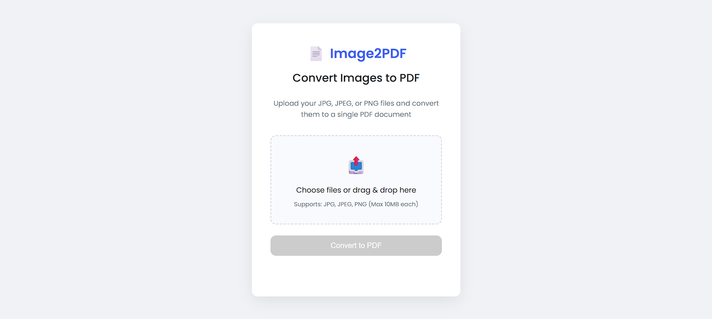
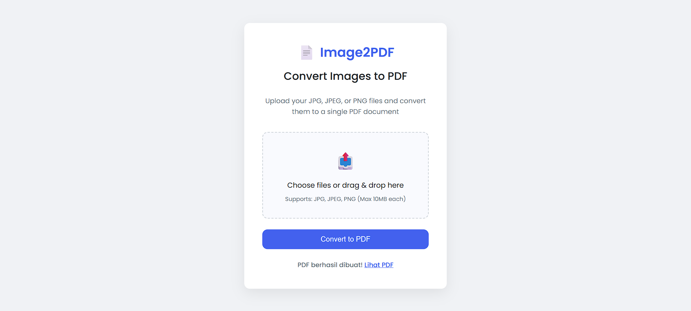

# 📄 Image to PDF Converter

Aplikasi web berbasis Go yang memungkinkan Anda mengunggah banyak gambar (JPG, JPEG, PNG), mengurutkannya secara **Natural Sorting**, dan mengonversinya menjadi satu file PDF.

---

## 🚀 Fitur Utama

- ✅ Konversi batch gambar ke satu file PDF  
- ✅ Natural sorting (pengurutan seperti gambar1, gambar2, gambar10)  
- ✅ Mendukung file JPG, JPEG, PNG (PNG otomatis dikonversi ke JPG)  
- ✅ Ukuran maksimum 10MB per gambar  
- ✅ Antarmuka drag & drop untuk upload gambar  
- ✅ Setiap hasil konversi disimpan sebagai PDF baru  
- ✅ Backend API dengan Gin dan pdfcpu  

---

## 🛠️ Teknologi

- **Backend**: Golang + Gin Framework  
- **PDF Generator**: [pdfcpu](https://github.com/pdfcpu/pdfcpu)  
- **Frontend**: HTML5, CSS3, JavaScript (drag & drop sederhana)  
- **Penyimpanan Sementara**: `uploads/`, hasil PDF di `output/`  

---

## 📚 Library Go yang Digunakan

```go
github.com/gin-gonic/gin                 // Web framework
github.com/pdfcpu/pdfcpu/pkg/api         // PDF generation
```
## 📦 Instalasi

### 🔧 Prasyarat

- Go 1.16 atau lebih baru

### 🧰 Langkah Instalasi

```bash
# Clone repositori
git clone https://github.com/nursal2404/Image-Convert-to-PDF.git
cd Image-Convert-to-PDF

# Install dependensi
go mod tidy

# Jalankan server
go run main.go
```

---
## Project View
### Start Page


### Convert Result

